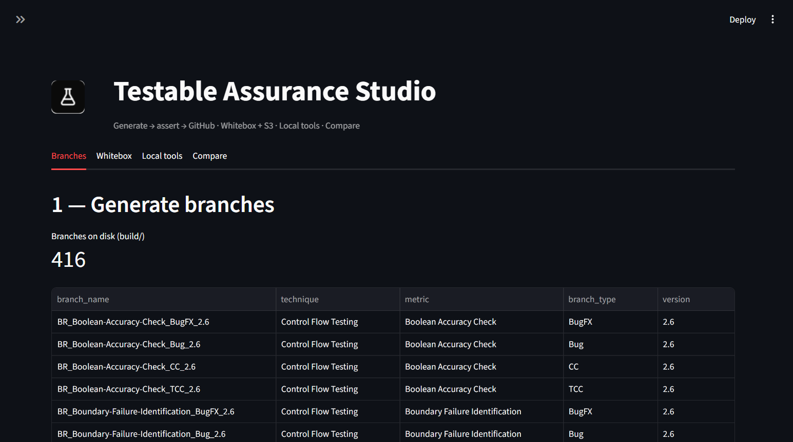
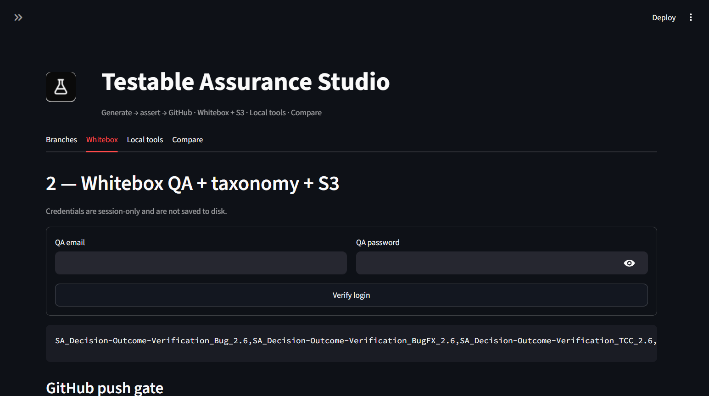
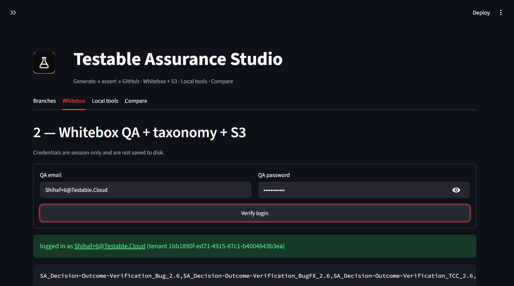
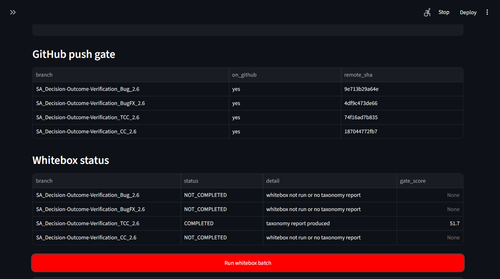
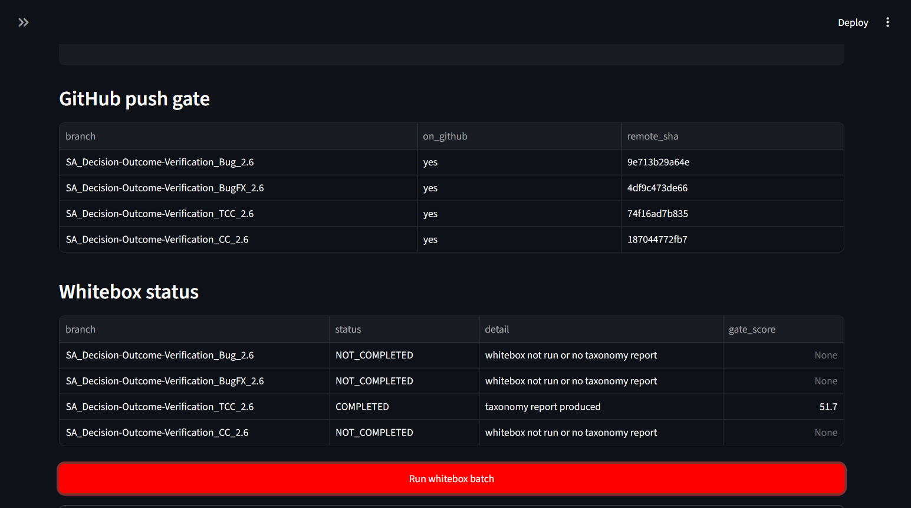
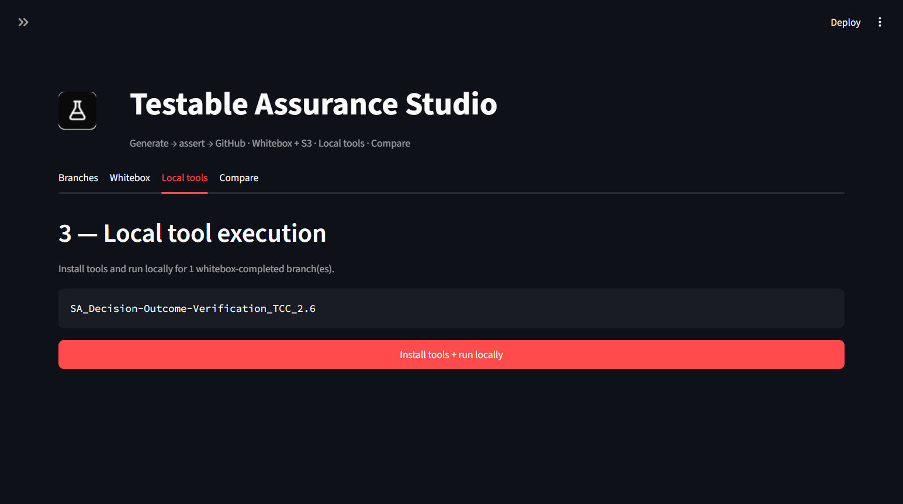
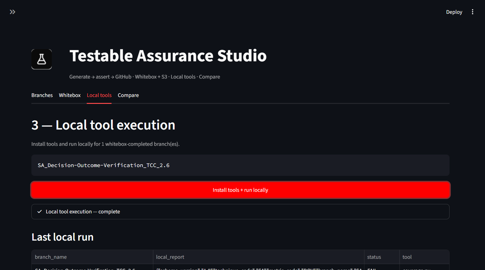
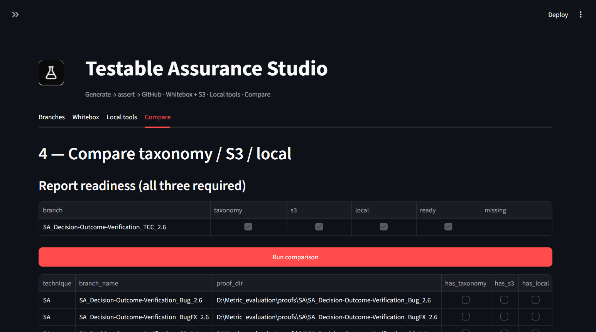
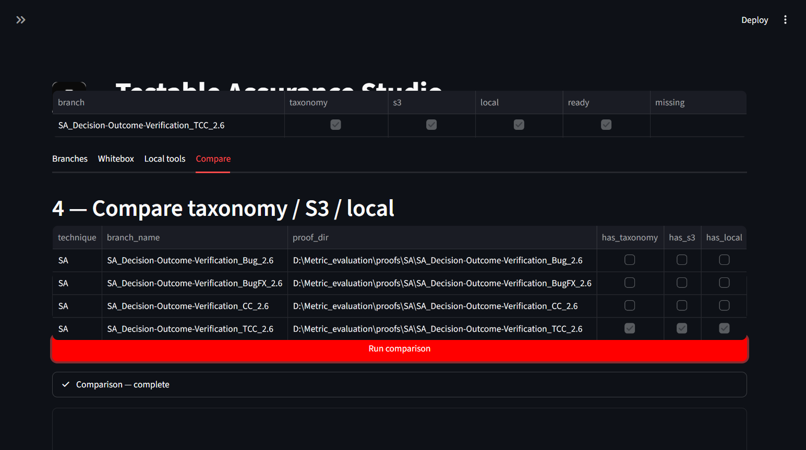

# Testable Assurance Studio — End-to-End Demo Walkthrough

**Date:** 13 June 2026  
**Account:** `Shihaf+6@Testable.Cloud`  
**App URL:** http://localhost:8501  
**Scope:** SA technique · Decision Outcome Verification (DOV) · 4 branch types (Bug, BugFX, TCC, CC) · version 2.6

This document is a step-by-step script you can follow when recording a screen capture for management review. Each step references a screenshot saved in this folder.

---

## What this demo proves

The **Testable Assurance Studio** UI runs the full metric-evaluation pipeline in four tabs:

```
Generate → assert → GitHub → Whitebox + S3 → Local tools → Compare
```

| Step | Tab | What happens |
|------|-----|--------------|
| 1 | Branches | Generate code branches, validate asserts, push to GitHub |
| 2 | Whitebox | Log into Testable, run whitebox QA, collect taxonomy + S3 proofs |
| 3 | Local tools | Install coverage tool and run locally on completed branches |
| 4 | Compare | Cross-check taxonomy vs S3 vs local reports and produce a verdict |

---

## Prerequisites

1. Streamlit app running: `py -3 -m streamlit run ui/app.py`
2. `.env.local` configured with Testable API URLs and S3 credentials
3. Sidebar selection:
   - **Technique:** SA — Structural Analysis
   - **Branch types:** Bug, BugFX, TCC, CC (all four)
   - **Version:** 2.6
   - **In scope:** 4 branches

---

## Step 1 — Branches (generate + push gate)


**Actions:**
1. Open the **Branches** tab.
2. Confirm **416** branches exist on disk (full registry); **4** are in scope for this demo.
3. Optionally click **Generate branches** (with assert + git + push enabled).
4. Scroll to **GitHub push status**.



**Expected result:**
- All 4 in-scope branches show `on_github: yes`
- Green banner: *"All in-scope branches are on GitHub — whitebox can run."*

| Branch | GitHub |
|--------|--------|
| `SA_Decision-Outcome-Verification_Bug_2.6` | yes |
| `SA_Decision-Outcome-Verification_BugFX_2.6` | yes |
| `SA_Decision-Outcome-Verification_TCC_2.6` | yes |
| `SA_Decision-Outcome-Verification_CC_2.6` | yes |

**Talking point:** Whitebox is blocked until every in-scope branch is pushed to GitHub.

---

## Step 2 — Whitebox (login + batch run)



**Actions:**
1. Open the **Whitebox** tab.
2. Enter QA credentials (session-only, not saved to disk):
   - Email: `Shihaf+6@Testable.Cloud`
   - Password: `Welcome1234!`
3. Click **Verify login**.



**Expected result:**
- Green success: *logged in as Shihaf+6@Testable.Cloud (tenant 1bb1890f-ed71-4915-87c1-b4004643b3ea)*
- Push gate table still shows all 4 branches on GitHub

4. Click **Run whitebox batch**.



**Progress indicators:**
- authenticating → authenticated
- resolving catalog → **1 branches ready** (catalog sync)
- starting → saved run → exporting taxonomy HTML
- collecting taxonomy + S3 proofs



**Expected result (this run):**

| Branch | Whitebox | Taxonomy | S3 | Gate score |
|--------|----------|----------|-----|------------|
| Bug_2.6 | NOT_COMPLETED | — | — | — |
| BugFX_2.6 | NOT_COMPLETED | — | — | — |
| **TCC_2.6** | **COMPLETED** | yes | SKIPPED | **51.7** |
| CC_2.6 | NOT_COMPLETED | — | — | — |

**Talking point:** All 4 branches are on GitHub, but Testable's catalog currently exposes only the **TCC** branch for this tenant. Bug/BugFX/CC will complete once catalog sync catches up. The pipeline still runs end-to-end on the branches that are available.

---

## Step 3 — Local tools



**Actions:**
1. Open the **Local tools** tab.
2. Confirm scope shows the 1 whitebox-completed branch: `SA_Decision-Outcome-Verification_TCC_2.6`
3. Click **Install tools + run locally**.



**Expected result:**
- Status: **Local tool execution — complete**
- Tool: `coverage.py`
- Local status: **FAIL** (0% coverage on TCC branch — expected for this branch type in current build)

**Talking point:** Local execution runs independently and produces a proof artifact stored under `proofs/SA/...`.

---

## Step 4 — Compare (taxonomy / S3 / local)



**Actions:**
1. Open the **Compare** tab.
2. Review **Report readiness** — TCC branch shows taxonomy ✓, s3 ✓, local ✓, ready ✓
3. Click **Run comparison**.



**Expected result:**
- Comparison — complete
- Summary: `MATCH=0 PARTIAL=0 MISMATCH=1 INCOMPLETE=0`
- **Verdict for TCC:** **MISMATCH** (taxonomy PASS vs local FAIL; S3 skipped)

**Inspect branch:** Select `SA_Decision-Outcome-Verification_TCC_2.6` and open the **Comparison** sub-tab to show the JSON proof bundle.

**Talking point:** A MISMATCH is a valid outcome — it means the three report sources disagree, which is exactly what this tab is designed to surface.

---

## Demo summary (for manager)

| Check | Status |
|-------|--------|
| App branding (Testable Assurance Studio + logo) | ✅ |
| Branch generation + GitHub push gate | ✅ 4/4 on GitHub |
| QA login (`Shihaf+6`) | ✅ |
| Whitebox + taxonomy export | ✅ 1/4 (catalog limit) |
| S3 proof collection | ⚠️ SKIPPED for TCC |
| Local tool execution | ✅ ran (FAIL expected) |
| Cross-report comparison | ✅ MISMATCH surfaced |

---

## Artifacts produced

| Artifact | Location |
|----------|----------|
| Taxonomy HTML reports | `taxonomy_reports/Structural Analysis/` |
| Proof bundles | `proofs/SA/SA_Decision-Outcome-Verification_TCC_2.6/` |
| Screenshots | `docs/e2e-demo/01-overview.png` … `10-compare-final.png` |

---

## Recording tips

1. Start at http://localhost:8501 with sidebar visible (shows **In scope: 4**, **QA: OK**, **S3: OK**).
2. Walk tabs left-to-right: Branches → Whitebox → Local tools → Compare.
3. Pause on the green login banner and the whitebox status table.
4. Mention the catalog sync caveat when only 1/4 branches complete whitebox.
5. End on the Compare tab with the MISMATCH verdict visible.

---

## Known limitation (not a UI bug)

Bug, BugFX, and CC branches are pushed to GitHub but not yet visible in the Testable catalog for tenant `1bb1890f-ed71-4915-87c1-b4004643b3ea`. Once catalog sync completes, re-run **Run whitebox batch** to process all 4 branches.
